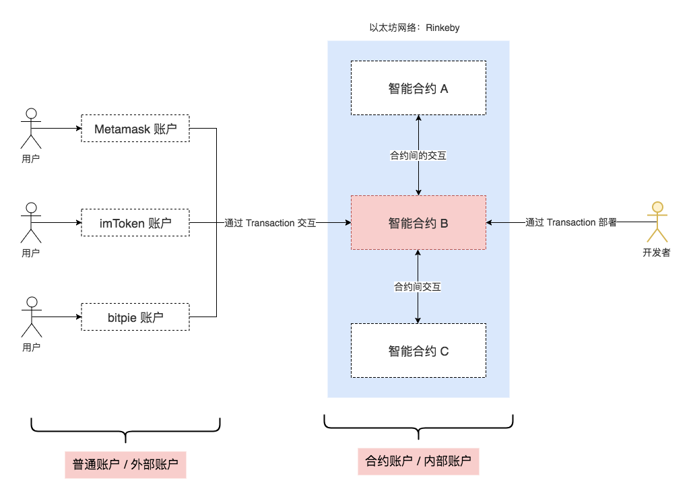
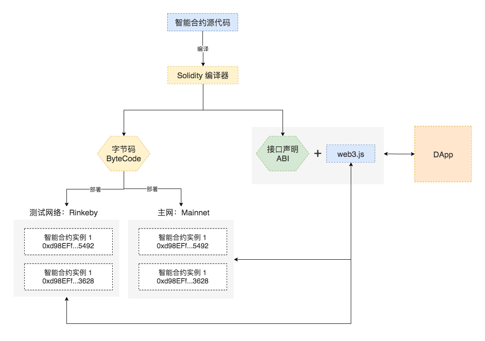

# 浅谈DApp(去中心化应用)
## —— 区块链技术的落地

---

## 章节

- Web时代的分级
- 区块链简史
- 什么是DApp(去中心化应用)
- 如何发布自己的DApp

---

## Web时代的分级

- **web1.0:** 系统生成什么，用户使用什么(新浪，门户网站)
- **web2.0:** 用户可以主动获取并生产内容(google)
- **web3.0:** 用户参与的互联网，用户拥有自己数据的所有权(区块链)

---

### WEB2.0的弊端

1. 2015年5月27日，杭州光纤被挖断，支付宝大规模宕机
2. 剑桥分析公司非法使用9000万名 Facebook 用户数据操纵选举
3. 微信QQ只有使用权，没有所有权
4. ……

---

# 中心化

---

## 区块链简史

1. 2008年10月31日: 中本聪发布[比特币白皮书](https://bitcoin.org/bitcoin.pdf)
2. 2013年末: V神([Vatalik Buterin](https://twitter.com/vitalikbuterin))发布[以太坊白皮书](https://github.com/ethereum/wiki/wiki/White-Paper)

---

### 区块链时代的分级

- **区块链1.0:** 只支持转账，财务交易(比特币)
- **区块链2.0:** 能够在转账基础上支持一定复杂度的业务逻辑定制——智能合约(以太坊)
- **区块链3.0:** 各种高性能底层公链，速度快，支持逻辑复杂(柚子)

---

### 区块链核心概念

- **账户（Account）** 由地址、公钥、私钥3部分构成，其中地址相当于用户名，而公钥+私钥相当于密码
- **交易（Transaction）** 两个账户之间的转账交易、或者智能合约调用请求
- **区块（Block）** 区块链中的每个区块都可能包含多笔交易，类比账本中的一页
- **区块链（Blockchain）** 区块链中不同区块按被矿工打包的时间先后组织而形成的长链

---

<Image src='./images/img01.jpg' size='100% auto'/>

---

### 区块链的驱动力——交易(Transaction)
日常生活中，“交易”本质上是指资产所有权的转移。
区块链中，经过签名运算，表达价值转移的过程。

---

<Image src='./images/transaction.png' size='100% auto'/>

---

### 交易(Transaction)关键属性

- TxHash: 交易流水号
- Block Height: 此交易发生后的打包情况
- From/To/Value: 说明交易的发起账户、接收账户，以及转账金额(智能合约调用时包含执行函数)
- Gas Limit 表示在交易执行时最多消耗的汽油数量
- Gas Used 表示实际使用了多少汽油
- Gas Price 表示汽油的价格是 0.0000000039 Ether，或者 3.9 Gwei
- Actual Tx Cost 表示实际的转账手续费是 0.0000819 Ether

---

## 什么是DApp——去中心化应用

1. 应用的数据，分布式存储在 *区块链* 的所有节点中
2. 得益于 *区块链* 的特性，应用的数据公开透明、不可篡改
3. 应用的逻辑采用智能合约实现，并部署到 *区块链* 上

---

### 什么是以太坊？

以太坊网络本质是 P2P 网络系统，其用途是发起交易、存储交易历史，这里的交易可以是转账或者是调用智能合约中的方法，而以太坊区块链则是存储了以太坊网络上发生过的每笔交易的数据库

---

### 如何同以太坊交互——智能合约

智能合约指以太坊网络上被代码控制的一个账户，不同于我们使用各种钱包软件 创建的账户（由创建账户的用户来控制），智能合约对应的账户是由代码控制的，其他账户（包括智能合约账户、普通用户账户）可以通过交易（Transaction）的方式与智能合约账户交互，社区中也会把智能合约账户称为内部账户，而普通用户账户称为外部账户...

---

---

### 智能合约关键属性

- **balance**，即该智能合约账户所控制的资产余额，比如某个抽奖智能合约中奖池的资金
- **storage**，智能合约的相关数据会存储在这里，可粗暴的将其看做是DApp的数据库，比如抽奖智能合约里面存储参与人的地址
- **code**，智能合约的字节码，由智能合约源代码编译而来，存储在区块链上方便任何节点接受智能合约的函数调用

---

### 智能合约编程语言 Solidity

- Solidity is a contract-oriented, high-level language for implementing smart contracts. It was influenced by C++, Python and JavaScript and is designed to target the Ethereum Virtual Machine (EVM)....
- Solidity 是面向合约的高级智能合约编程语言，其设计受到了 C++、Python、Javascript 语言的影响，运行环境是以太坊虚拟机（EVM）

---

---

### 使用Solidity进行智能合约开发

- 最容易上手——Remix 集成开发环境
- FE最熟悉——更符合前端开发的工作流

---

### Remix 集成开发环境简介

https://remix.ethereum.org

---

### 前端工作流简介

https://github.com/wangshijun/ethereum-contract-workflow

---

## DApp只能依赖区块链吗？

---

### [DAG(有向无环图)](http://www.huoxing24.com/newsdetail/20181031075600967824.html)
### [VAG](https://vite.org)

---

### 相关链接：
1. [区块链开发入门：从 0 到 1 构建基于以太坊智能合约的 ICO DApp](https://juejin.im/book/5addb2eb6fb9a07abd0d4557)
2. [区块链vs.DAG, 区别到底是什么?](http://www.huoxing24.com/newsdetail/20181031075600967824.html)
3. [理解Web 3——用户控制的互联网](http://www.infoq.com/cn/articles/understanding-web-3-a-user-controlled-internet)
4. [Remix - Solidity IDE](https://remix.ethereum.org)
5. [Faucet - 以太坊测试账号充值18 ETH](https://faucet.rinkeby.io/)
6. [Solidity 官网](https://solidity.readthedocs.io/en/v0.4.23/)
7. [metamask - google区块链钱包插件](https://chrome.google.com/webstore/detail/metamask/nkbihfbeogaeaoehlefnkodbefgpgknn/related?hl=en)
8. [以太坊开发测试网络列表](https://testnet.etherscan.io/)

---

export default Split

### Maple
- 使用合适的工具做合适的事情

